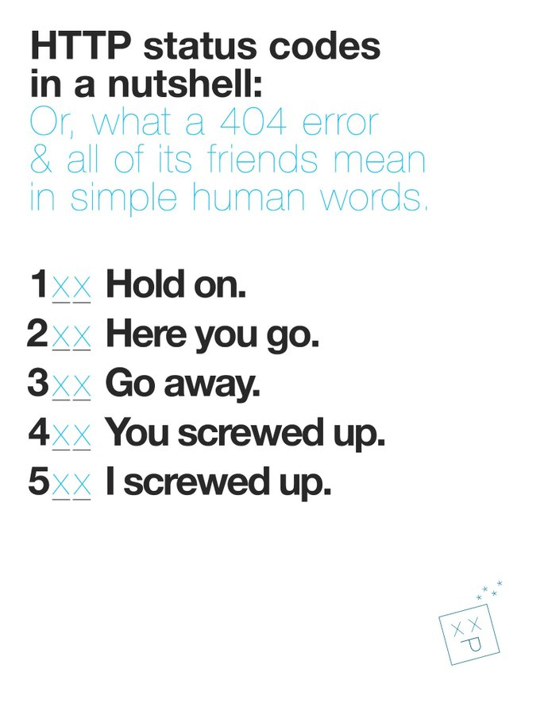

# Suggested refactoring / improvements

## P1: Continuous Integration
### Setup Code Formatter & Linter

Code formatter and linter should be setup as part of the Continuous Integration Process and merges of code should be disallowed if the linter reported errors

### Test Execution

Test should be executed automatically whenver a Pull Request is submitted and merges of code should be disallowed when there are failing tests

### Code Coverage

Code Coverage should be setup and merges of code should be disallowed should the code coverage drop when new changes were made (with certain exceptions allowed)

## Caching of DNS Records

DNS record seldom changes and therefore might be useful to set a cache for example 5 minutes and it will help in the process of verifying document when there's frequent file uploads on the same domain
## Grouping of code based on domain

As applications grow, knowledge and login grew in different domains and therefore it might be useful to separate the logic out into different folders at the beginning of the projects and have it as a practices for the team

## Usage of HTTP code in order to better reflect of statuses

HTTP code should be used as a reflection of the status of the request.
However this might be a requirements or is something that has been agreed upon by the team. If that's the case then we need to document it down the justification / reasoning behind and share across the team.

## Further clarification of coding standards

In Laravel Test, the convention is to use snake_case for test methods (Reference: https://laravel.com/docs/10.x/testing#creating-tests) however it was not specified within the Coding Standard

